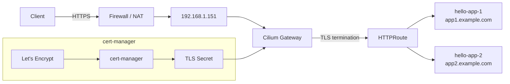

# Cilium Gateway API with cert-manager and Let's Encrypt

## Overview

This guide builds on **Cilium Gateway API with LB-IPAM and L2 Announcement**.

The existing Cilium Gateway, LoadBalancer IP, L2 Announcement configuration and applications remain unchanged.

This guide adds:

- cert-manager
- Let's Encrypt (production)
- HTTPS on the existing Gateway
- Automatic TLS certificate renewal

Two validation methods are covered:

- **HTTP-01** — validates ownership by serving a token over port 80. Requires port 80 to be reachable from the internet.
- **DNS-01** — validates ownership by creating a TXT record via a DNS provider webhook. Useful when port 80 is not available, or for wildcard certificates.

Pick the method that fits your setup — you only need one.

### Traffic Flow Diagram



---

## Prerequisites

This guide assumes the previous guide has already been completed successfully. You should already have:

- A working Kubernetes cluster
- Cilium with Gateway API, LB-IPAM and L2 Announcement
- A working `GatewayClass` (`cilium`)
- Gateway `demo-gateway`
- Applications `hello-app-1` and `hello-app-2` with their HTTPRoutes

Verify the Gateway:

```bash
kubectl get gateway
```

Example:

```
NAME            CLASS    ADDRESS          PROGRAMMED   AGE
demo-gateway    cilium   192.168.1.151    True         ...
```

Verify the HTTPRoutes:

```bash
kubectl get httproute
```

Example:

```
NAME                HOSTNAMES
hello-app-1-route   app1.example.com
hello-app-2-route   app2.example.com
```

---

## 1. Configure DNS

Let's Encrypt must be able to validate ownership of the hostnames.

Make sure the DNS records for the hostnames point to your public IP address:

```
app1.example.com    A    <PUBLIC-IP>
app2.example.com    A    <PUBLIC-IP>
```

If you plan to use **HTTP-01**, your firewall must also forward HTTP and HTTPS traffic to the Gateway LoadBalancer IP:

```
TCP/80    -> 192.168.1.151:80
TCP/443   -> 192.168.1.151:443
```

HTTP is required because HTTP-01 serves the challenge token over port 80. During certificate issuance, cert-manager creates a temporary HTTPRoute for the challenge. The existing Gateway therefore needs to keep an HTTP listener on port 80.

If you plan to use **DNS-01** instead, port 80 does not need to be reachable — only HTTPS (port 443) needs to be forwarded:

```
TCP/443   -> 192.168.1.151:443
```

---

## 2. Install cert-manager

cert-manager is responsible for requesting and renewing the certificates.

If you plan to use the DNS-01 challenge, add the following two options to the Helm command below. They are not required for HTTP-01.

```
--set dns01RecursiveNameservers="80.65.96.50:53" \
--set dns01RecursiveNameserversOnly=true
```

```bash
helm install \
  cert-manager oci://quay.io/jetstack/charts/cert-manager \
  --version v1.21.0 \
  --namespace cert-manager \
  --create-namespace \
  --set crds.enabled=true \
  --set config.gatewayAPI.enabled=true
```

Check the installation:

```bash
kubectl get pods -n cert-manager
```

Expected:

```
NAME                          READY   STATUS
cert-manager-...              1/1     Running
cert-manager-cainjector-...   1/1     Running
cert-manager-webhook-...      1/1     Running
```

The Gateway API integration must be enabled because cert-manager will create temporary HTTPRoute resources for the ACME HTTP-01 challenge, if used.

**Only using DNS-01?** Continue with **2a. Install the DNS-01 webhook** below before creating the ClusterIssuer. **Only using HTTP-01?** Skip ahead to **3. Create the Let's Encrypt ClusterIssuer**.

---

## 2a. Install the DNS-01 webhook (DNS-01 only)

DNS-01 validation requires a webhook that can create the required TXT record at your DNS provider. This example uses the PowerDNS webhook, matching the setup used in **LetsEncrypt automatic validation via PowerDNS**. If you use a different DNS provider, install the matching cert-manager DNS-01 webhook instead — the rest of this guide stays the same.

```bash
helm repo add cert-manager-webhook-pdns https://zachomedia.github.io/cert-manager-webhook-pdns
helm install --namespace cert-manager cert-manager-webhook-pdns cert-manager-webhook-pdns/cert-manager-webhook-pdns
```

Expected output:

```
NAME: cert-manager-webhook-pdns
LAST DEPLOYED: <date>
NAMESPACE: cert-manager
STATUS: deployed
REVISION: 1
TEST SUITE: None
```

**Important:** wait until all cert-manager pods are `Running` before installing this webhook, or it will not initialize properly.

### Create the API token secret

Create an API token/secret at your DNS provider that is allowed to manage DNS records for your zone, then store it as a Kubernetes Secret:

```yaml
apiVersion: v1
kind: Secret
metadata:
  name: dns-api-key
  namespace: cert-manager
type: Opaque
data:
  key: "<base64 token>"
```

Apply:

```bash
kubectl apply -f dns-api-key-secret.yaml
```

---

## 3. Create the Let's Encrypt ClusterIssuer

Choose the solver configuration that matches the validation method you picked in step 1.

### Option A — HTTP-01

Create: `letsencrypt-production.yaml`

```yaml
apiVersion: cert-manager.io/v1
kind: ClusterIssuer
metadata:
  name: letsencrypt-production
spec:
  acme:
    email: admin@example.com
    server: https://acme-v02.api.letsencrypt.org/directory
    privateKeySecretRef:
      name: letsencrypt-production
    solvers:
    - http01:
        gatewayHTTPRoute:
          parentRefs:
          - name: demo-gateway
            namespace: default
            kind: Gateway
```

The `gatewayHTTPRoute.parentRefs` configuration tells cert-manager to use the existing `demo-gateway` for the HTTP-01 challenge. cert-manager will create a temporary HTTPRoute that points to its ACME challenge solver. After the certificate has been issued, the temporary HTTPRoute is removed.

### Option B — DNS-01 (PowerDNS webhook)

Create: `letsencrypt-production.yaml`

```yaml
apiVersion: cert-manager.io/v1
kind: ClusterIssuer
metadata:
  name: letsencrypt-production
spec:
  acme:
    email: admin@example.com
    server: https://acme-v02.api.letsencrypt.org/directory
    privateKeySecretRef:
      name: letsencrypt-production
    solvers:
    - dns01:
        webhook:
          groupName: acme.zacharyseguin.ca
          solverName: pdns
          config:
            host: https://your-pdns-api-endpoint
            apiKeySecretRef:
              name: dns-api-key
              key: key
            apiKeyHeaderName: "X-Auth-Token"
            serverID: "localhost"
            ttl: 300
            timeout: 30
```

Replace `host` with your DNS provider's API endpoint. With DNS-01, cert-manager creates a TXT record (`_acme-challenge.<hostname>`) at the DNS provider instead of using an HTTPRoute, so port 80 is not needed.

### Apply

Replace `admin@example.com` with a valid email address, then apply whichever option you chose:

```bash
kubectl apply -f letsencrypt-production.yaml
```

Check:

```bash
kubectl get clusterissuer
```

Expected:

```
NAME                      READY
letsencrypt-production    True
```

---

## 4. Create the TLS Certificate

We will request one certificate containing both application hostnames. This step is the same regardless of the validation method chosen.

Create: `gateway-certificate.yaml`

```yaml
apiVersion: cert-manager.io/v1
kind: Certificate
metadata:
  name: demo-gateway-tls
spec:
  secretName: demo-gateway-tls
  issuerRef:
    name: letsencrypt-production
    kind: ClusterIssuer
  dnsNames:
  - app1.example.com
  - app2.example.com
```

Apply:

```bash
kubectl apply -f gateway-certificate.yaml
```

Check:

```bash
kubectl get certificate
```

Wait for cert-manager to complete the ACME challenge. Expected:

```
NAME                READY   SECRET              AGE
demo-gateway-tls    True    demo-gateway-tls    ...
```

Verify the TLS Secret:

```bash
kubectl get secret demo-gateway-tls
```

Expected:

```
NAME                TYPE                DATA
demo-gateway-tls    kubernetes.io/tls   2
```

---

## 5. Update the Gateway

The existing Gateway currently listens for HTTP traffic on port 80. We will add an HTTPS listener on port 443.

Update: `gateway.yaml`

```yaml
apiVersion: gateway.networking.k8s.io/v1
kind: Gateway
metadata:
  name: demo-gateway
spec:
  gatewayClassName: cilium
  infrastructure:
    labels:
      advertise: "true"
    annotations:
      kube-vip.io/ignore: "true"
  listeners:
  - name: http
    protocol: HTTP
    port: 80
  - name: https
    protocol: HTTPS
    port: 443
    tls:
      mode: Terminate
      certificateRefs:
      - name: demo-gateway-tls
```

Apply:

```bash
kubectl apply -f gateway.yaml
```

Check:

```bash
kubectl get gateway demo-gateway
```

`PROGRAMMED` should remain `True`. The TLS connection is terminated at the Cilium Gateway; the connection from the Gateway to the backend remains plain HTTP.

**Note:** if you used DNS-01, you may keep the `http` listener for regular application traffic, or remove it if all traffic should go over HTTPS — it is no longer required for certificate validation.

---

## 6. Verify the HTTPRoutes

The existing HTTPRoutes do not need to be changed, for example:

```yaml
apiVersion: gateway.networking.k8s.io/v1
kind: HTTPRoute
metadata:
  name: hello-app-1-route
spec:
  parentRefs:
  - name: demo-gateway
  hostnames:
  - app1.example.com
  rules:
  - backendRefs:
    - name: hello-app-1
      port: 80
```

The same HTTPRoute can now also be accessed through the HTTPS listener.

```
kubectl get httproute
```

The routes should still be accepted by the Gateway.

---

## 7. Test HTTPS

```bash
curl https://app1.example.com
curl https://app2.example.com
```

Both applications are now accessible over HTTPS with a valid, browser-trusted Let's Encrypt certificate.

---

## 8. Automatic Renewal

cert-manager automatically manages the certificate lifecycle.

```bash
kubectl get certificate demo-gateway-tls -o wide
kubectl describe certificate demo-gateway-tls
```

`Ready` should be `True`. cert-manager will automatically renew the certificate before it expires — no manual certificate replacement is required.

---

## Troubleshooting

**Certificate is not ready**

```bash
kubectl describe certificate demo-gateway-tls
kubectl get certificaterequest
kubectl get order
kubectl get challenge
```

These resources can be used to determine where the ACME process is failing.

**HTTP-01 challenge is failing**

```bash
kubectl get httproute
```

During certificate issuance an additional `cm-acme-http-solver-*` route should appear temporarily. Verify that it references `demo-gateway`, and that the Gateway has a listener on port 80 — do not remove it while the HTTP-01 challenge is in use.

**DNS-01 challenge is failing**

Check the logs of the webhook pod:

```bash
kubectl logs -n cert-manager -l app=cert-manager-webhook-pdns
```

Verify that the TXT record `_acme-challenge.<hostname>` was actually created at your DNS provider, and that the API token has permission to manage that zone.

**Let's Encrypt cannot reach the challenge (HTTP-01)**

Make sure incoming HTTP traffic on TCP/80 is actually forwarded to `192.168.1.151:80`.

**HTTPS listener is not programmed**

```bash
kubectl describe gateway demo-gateway
kubectl get secret demo-gateway-tls
```

If the Secret does not exist, check the status of the Certificate.

---

## Cleanup

```bash
kubectl delete certificate demo-gateway-tls
kubectl delete clusterissuer letsencrypt-production
kubectl delete secret demo-gateway-tls
helm uninstall cert-manager -n cert-manager
```

If DNS-01 was used, also remove the webhook:

```bash
helm uninstall cert-manager-webhook-pdns -n cert-manager
kubectl delete secret dns-api-key -n cert-manager
```

The existing Cilium Gateway, LB-IPAM, L2 Announcement configuration, applications and HTTPRoutes are not removed.

---

## Conclusion

The existing Cilium Gateway now provides HTTPS with automatically managed Let's Encrypt certificates, using either HTTP-01 or DNS-01 validation. Cilium remains responsible for the Gateway, the LoadBalancer IP and traffic routing, while cert-manager manages the TLS certificate lifecycle.
