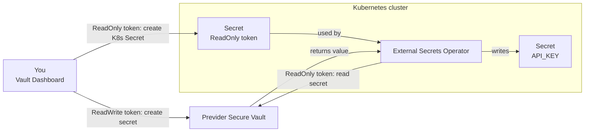

# Previder Secure Vault and External Secrets Operator in Kubernetes

## About Previder Secure Vault

Previder Secure Vault is a secrets management service, offered through the **[Previder Portal](https://portal.previder.nl)** self-service portal. No installation inside the Kubernetes cluster is required: everything the vault itself, its tokens and secrets is created and managed through the **[Vault Dashboard](https://vault.previder.io/ui/#/login)** in the portal.

## About External Secrets Operator

External Secrets Operator (ESO) is a Kubernetes operator that reads secrets from an external system in this case Previder Secure Vault and creates a native Kubernetes `Secret` from them, which applications consume as usual. ESO has built-in, native support for Previder Secure Vault, so no custom integration is needed.

## Overview

This guide creates a Secure Vault environment and its tokens and secrets through the Previder Portal's Vault Dashboard, and uses External Secrets Operator's native Previder provider to deliver a secret into the cluster as a Kubernetes `Secret`:

1. Create a Secure Vault environment in the Previder Portal.
2. Create a ReadWrite and a ReadOnly access token for it.
3. Store a secret (e.g. a password) in the vault using the ReadWrite token.
4. Install External Secrets Operator in the cluster.
5. Configure a `SecretStore` (where the vault is) and an `ExternalSecret` (which secret to fetch), using the ReadOnly token.
6. The application reads the result as a normal Kubernetes `Secret`.

### Token Types

Previder Secure Vault uses three token types, each with a different scope:

| | EnvironmentAdmin | ReadWrite | ReadOnly |
|---|---|---|---|
| Manage tokens | ✅ | | |
| Manage secrets | | ✅ | |
| Get decrypted secret | | ✅ | ✅ |

The token received when a Secure Vault environment is created is always an **EnvironmentAdmin** token. In the Vault Dashboard, that token is used once to create:

- A **ReadWrite** token — used to manage secrets (create, update, delete), from the dashboard or a secured workstation/CI pipeline.
- A **ReadOnly** token — used by the cluster to read secrets. This is the only token that ends up inside Kubernetes.

**Important:** Only a ReadOnly token is placed inside the cluster. A compromised cluster can therefore read the secrets it was given access to, but cannot create, modify or delete secrets, and cannot create further tokens.

### Architecture Diagram



---

# Prerequisites

This guide assumes:

- A running Kubernetes cluster, as described in the [Installatiehandleiding](https://github.com/previder/kubernetes-examples/tree/main/docs)
- `helm` and `kubectl` configured against the cluster
- Access to the [Previder Portal](https://portal.previder.nl) to create a Secure Vault environment

---

# 1. Create a Secure Vault Environment

Create a Secure Vault environment via the [Previder Portal](https://portal.previder.nl). This generates the initial **EnvironmentAdmin** token for that environment.

---

# 2. Create a ReadWrite and a ReadOnly Token

Open the **[Vault Dashboard](https://vault.previder.io/ui/#/login)** for the environment and create two tokens: a **ReadWrite** token and a **ReadOnly** token.

👉 Give each application its own ReadOnly token with a clear description (e.g. "hello-app — production"), rather than reusing one token across the whole cluster, so access can be revoked per application if needed.

---

# 3. Store a Secret in the Vault

In the **[Vault Dashboard](https://vault.previder.io/ui/#/login)**, using the **ReadWrite** token, create an example secret for an application called `hello-app`. Give it a clear name or description, such as `hello-app-api-key` this exact name is needed again in step 7.

**Note:** Instead of the Vault Dashboard, secrets and keys can also be managed from the command line using [`vault-cli`](https://github.com/previder/vault-cli). See that repository for installation and usage instructions this guide only covers the dashboard, since it requires nothing to install.

---

# 4. Install External Secrets Operator

```
helm repo add external-secrets https://charts.external-secrets.io
helm repo update
helm install external-secrets external-secrets/external-secrets -n external-secrets --create-namespace
```

Verify:

```
kubectl -n external-secrets get pods
```

Expected output:

```
NAME                                    READY   STATUS    RESTARTS   AGE
external-secrets-...                    1/1     Running   0          30s
external-secrets-cert-controller-...    1/1     Running   0          30s
external-secrets-webhook-...            1/1     Running   0          30s
```

---

# 5. Store the ReadOnly Token as a Kubernetes Secret

Create the namespace the application will run in:

```
kubectl create namespace hello-app
```

Store the ReadOnly token from step 2 as a Kubernetes `Secret`, directly from the command line so it never touches a file on disk:

```
kubectl -n hello-app create secret generic previder-vault-token \
  --from-literal=previder-vault-token="<readonly_token>"
```

---

# 6. Create a SecretStore

A `SecretStore` tells External Secrets Operator how to reach Previder Secure Vault. This one is scoped to the `hello-app` namespace, matching the Secret created in step 5.

`hello-app-secretstore.yaml`

```
apiVersion: external-secrets.io/v1
kind: SecretStore
metadata:
  name: previder-backend
  namespace: hello-app
spec:
  provider:
    previder:
      auth:
        secretRef:
          accessToken:
            name: previder-vault-token
            key: previder-vault-token
```

Apply:

```
kubectl apply -f hello-app-secretstore.yaml
```

Verify:

```
kubectl -n hello-app get secretstore previder-backend
```

Expected output:

```
NAME               AGE   STATUS   CAPABILITIES   READY
previder-backend   10s   Valid    ReadOnly       True
```

---

# 7. Create an ExternalSecret

`hello-app-externalsecret.yaml`

```
apiVersion: external-secrets.io/v1
kind: ExternalSecret
metadata:
  name: hello-app-api
  namespace: hello-app
spec:
  refreshInterval: 1h
  secretStoreRef:
    name: previder-backend
    kind: SecretStore
  target:
    name: hello-app-api
    creationPolicy: Owner
  data:
  - secretKey: API_KEY
    remoteRef:
      key: hello-app-api-key
```

👉 `remoteRef.key` is the id/description used in step 3. `refreshInterval` controls how often ESO checks the vault for changes, if the secret's value is updated later, the Kubernetes `Secret` is updated automatically within that interval, no `kubectl apply` needed.

Apply:

```
kubectl apply -f hello-app-externalsecret.yaml
```

---

# 8. Verify

```
kubectl -n hello-app get externalsecret hello-app-api
```

Expected output:

```
NAME            STORE              REFRESH INTERVAL   STATUS         READY
hello-app-api   previder-backend   1h                  SecretSynced   True
```

Confirm the value ended up correctly in the Kubernetes Secret:

```
kubectl -n hello-app get secret hello-app-api -o jsonpath='{.data.API_KEY}' | base64 -d
```

This should show the value you chose in step 3, for example:

```
s3cr3t-api-key-value
```

---

# 9. Update the Secret and Observe the Sync

To demonstrate that ESO keeps the Kubernetes `Secret` in sync with the vault, delete the `hello-app-api-key` secret in the Vault Dashboard (using the ReadWrite token) and recreate it under the **same** name/id, but with a different value for example `s3cr3t-api-key-value-v2`.

By default, this reaches Kubernetes within the `refreshInterval` configured in step 7 (`1h`). To confirm the sync without waiting, force it immediately:

```
kubectl -n hello-app annotate externalsecret hello-app-api force-sync=$(date +%s) --overwrite
```

Check that the Kubernetes `Secret` now holds the new value:

```
kubectl -n hello-app get secret hello-app-api -o jsonpath='{.data.API_KEY}' | base64 -d
```

Expected output:

```
s3cr3t-api-key-value-v2
```

**Note:** `envFrom` only reads a Secret once, when a Pod starts — an updated value in the vault reaches the Kubernetes `Secret` automatically, but running Pods only pick it up after a restart. A tool like [Stakater Reloader](https://github.com/stakater/Reloader) can trigger that restart automatically when the Secret changes.

---

# 10. Add More Secrets

The token, the Secret holding it and the `SecretStore` (steps 2, 5 and 6) are set up once and are reused for every additional secret. For a second (or third) password, only two things are needed:

1. **Create the secret in the Vault Dashboard** using the ReadWrite token, as in step 3 — for example `hello-app-db-password`.
2. **Reference it in an `ExternalSecret`.** There are two options:

**Option A — add it to the existing `ExternalSecret`**, so both values end up in the same Kubernetes `Secret` as separate keys. Add another entry under `data` in `hello-app-externalsecret.yaml`:

```
  data:
  - secretKey: API_KEY
    remoteRef:
      key: hello-app-api-key
  - secretKey: DB_PASSWORD
    remoteRef:
      key: hello-app-db-password
```

```
kubectl apply -f hello-app-externalsecret.yaml
```

**Option B — create a separate `ExternalSecret`**, resulting in its own Kubernetes `Secret`. Copy `hello-app-externalsecret.yaml`, and change `metadata.name`, `target.name`, `secretKey` and `remoteRef.key`.

Verify the new value:

```
kubectl -n hello-app get secret hello-app-api -o jsonpath='{.data.DB_PASSWORD}' | base64 -d
```

---

**Next steps:**
- Create a separate ReadOnly token and `SecretStore` per application/namespace, rather than sharing one token across the whole cluster.
- Manage secrets from the Vault Dashboard (or `vault-cli`) using the ReadWrite token — never from inside the cluster.
