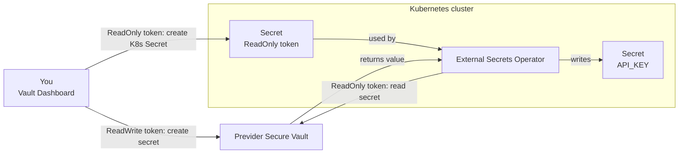

# Previder Secure Vault and External Secrets Operator in Kubernetes

## About Previder Secure Vault

Previder Secure Vault is a secrets management service offered through the [Previder Portal](https://portal.previder.nl) self-service portal. Unlike a self-hosted secrets manager, no installation inside the Kubernetes cluster is required: a Secure Vault environment, its tokens and its secrets are all created and managed through the **Vault Dashboard** in the portal. Every environment uses its own unique encryption key, which is never stored by Previder and is only available to the customer.

## About External Secrets Operator

External Secrets Operator (ESO) is a Kubernetes operator that reads secrets from an external system in this case Previder Secure Vault and creates a native Kubernetes `Secret` from them. Applications keep reading a normal `Secret`; ESO takes care of keeping that `Secret` in sync with what's stored in the vault. ESO has built-in, native support for Previder Secure Vault, so no custom integration is needed.

## Overview

This guide creates a Secure Vault environment and its tokens and secrets through the Previder Portal's Vault Dashboard, and uses External Secrets Operator's native Previder provider to deliver a secret into the cluster as a Kubernetes `Secret`.

### Token Types

Previder Secure Vault uses three token types, each with a different scope:

| | EnvironmentAdmin | ReadWrite | ReadOnly |
|---|---|---|---|
| Manage tokens | ✅ | | |
| Manage secrets | | ✅ | |
| Get decrypted secret | | ✅ | ✅ |

The token received when a Secure Vault environment is created in the portal is always an **EnvironmentAdmin** token. In the Vault Dashboard, that environment is used to create a **ReadWrite** token (for managing secrets) and a **ReadOnly** token (for reading secrets from applications).

**Important:** Only a **ReadOnly** token is placed inside the Kubernetes cluster. It can read the secrets it's given the id/name of, but cannot list, create or delete secrets, and cannot create further tokens so a compromised cluster cannot use it to gain broader access to the vault.

### Architecture Diagram



---

# Prerequisites

This guide assumes:

- A running Kubernetes cluster, as described in the [Installatiehandleiding](https://github.com/previder/kubernetes-examples/tree/main/docs)
- `helm` and `kubectl` configured against the cluster
- Access to the [Previder Portal](https://portal.previder.nl) to create a Secure Vault environment
- No prior Vault or External Secrets Operator knowledge required

---

# 1. Create a Secure Vault Environment

Create a Secure Vault environment via the [Previder Portal](https://portal.previder.nl). This generates the initial **EnvironmentAdmin** token for that environment.

---

# 2. Create a ReadWrite and a ReadOnly Token

Open the **Vault Dashboard** for the environment in the Previder Portal and create two tokens:

- A **ReadWrite** token, used to manage secrets (create, update, delete) keep this one out of the cluster, and use it only from the dashboard itself or a secured workstation/CI pipeline.
- A **ReadOnly** token, used by the cluster to read secrets this is the only token that ends up inside Kubernetes.

**Important:** Give each application (or namespace) its own ReadOnly token with its own description, rather than sharing a single token across the whole cluster, so access can be revoked per application if needed.

---

# 3. Store a Secret in the Vault

In the Vault Dashboard, using the **ReadWrite** token, create an example secret an API key for an application called `hello-app`. Note the secret's id or description; either is used to retrieve it later.

**Note:** Tokens and secrets can also be managed from the command line instead of the Vault Dashboard, using [`vault-cli`](https://github.com/previder/vault-cli). See the `vault-cli` repository for installation and usage instructions.

---

# 4. Install External Secrets Operator

```
helm repo add external-secrets https://charts.external-secrets.io
helm repo update
helm install external-secrets external-secrets/external-secrets -n external-secrets --create-namespace
```

Verify:

```
kubectl -n external-secrets get pods
```

Expected output:

```
NAME                                    READY   STATUS    RESTARTS   AGE
external-secrets-...                    1/1     Running   0          30s
external-secrets-cert-controller-...    1/1     Running   0          30s
external-secrets-webhook-...            1/1     Running   0          30s
```

---

# 5. Store the ReadOnly Token as a Kubernetes Secret

Create the namespace the application will run in:

```
kubectl create namespace hello-app
```

Store the ReadOnly token created in step 2 as a Kubernetes `Secret`, directly from the command line so it never touches a file on disk:

```
kubectl -n hello-app create secret generic previder-vault-token \
  --from-literal=previder-vault-token="<readonly_token>"
```

---

# 6. Create a SecretStore

A `SecretStore` tells External Secrets Operator how to reach Previder Secure Vault. This one is scoped to the `hello-app` namespace, matching the Secret created in step 5.

`hello-app-secretstore.yaml`

```
apiVersion: external-secrets.io/v1
kind: SecretStore
metadata:
  name: previder-backend
  namespace: hello-app
spec:
  provider:
    previder:
      auth:
        secretRef:
          accessToken:
            name: previder-vault-token
            key: previder-vault-token
```

```
kubectl apply -f hello-app-secretstore.yaml
```

Verify:

```
kubectl -n hello-app get secretstore previder-backend
```

Expected output:

```
NAME               AGE   STATUS   CAPABILITIES   READY
previder-backend   10s   Valid    ReadOnly       True
```

---

# 7. Create an ExternalSecret

`hello-app-externalsecret.yaml`

```
apiVersion: external-secrets.io/v1
kind: ExternalSecret
metadata:
  name: hello-app-api
  namespace: hello-app
spec:
  refreshInterval: 1h
  secretStoreRef:
    name: previder-backend
    kind: SecretStore
  target:
    name: hello-app-api
    creationPolicy: Owner
  data:
  - secretKey: API_KEY
    remoteRef:
      key: hello-app-api-key
```

```
kubectl apply -f hello-app-externalsecret.yaml
```

**Important:** `remoteRef.key` is the id or description used in step 3. `refreshInterval` controls how often ESO checks the vault for changes if the secret's value is updated later, the Kubernetes `Secret` is updated automatically within that interval, no `kubectl apply` needed.

---

# 8. Verify

```
kubectl -n hello-app get externalsecret hello-app-api
```

Expected output:

```
NAME            STORE              REFRESH INTERVAL   STATUS         READY
hello-app-api   previder-backend   1h                  SecretSynced   True
```

Confirm the value ended up correctly in the Kubernetes Secret:

```
kubectl -n hello-app get secret hello-app-api -o jsonpath='{.data.API_KEY}' | base64 -d
```

Expected output:

```
s3cr3t-api-key-value
```

---

# 9. Update the Secret and Observe the Sync

To demonstrate that ESO keeps the Kubernetes `Secret` in sync with the vault, delete the `hello-app-api-key` secret in the Vault Dashboard (using the ReadWrite token) and recreate it under the **same** name/id, but with a different value for example `s3cr3t-api-key-value-v2`.

By default, this reaches Kubernetes within the `refreshInterval` configured in step 7 (`1h`). To confirm the sync without waiting, force it immediately:

```
kubectl -n hello-app annotate externalsecret hello-app-api force-sync=$(date +%s) --overwrite
```

Check that the Kubernetes `Secret` now holds the new value:

```
kubectl -n hello-app get secret hello-app-api -o jsonpath='{.data.API_KEY}' | base64 -d
```

Expected output:

```
s3cr3t-api-key-value-v2
```

---

## ✅ Summary

- Previder Secure Vault is a hosted, multi-tenant secrets service managed entirely through the Previder Portal's Vault Dashboard nothing needs to be installed inside the cluster for the vault itself.
- An **EnvironmentAdmin** token is only used to set up the environment and create narrower tokens; it is never placed in the cluster.
- A **ReadWrite** token, used from the dashboard, is where secrets are created and managed.
- A **ReadOnly** token is what actually goes into the cluster, scoped to reading secrets only least privilege by design.
- External Secrets Operator's built-in Previder provider authenticates with that ReadOnly token and keeps a Kubernetes `Secret` automatically in sync with what's stored in the vault.
- This pattern (steps 3, 5–8) is the general-purpose reference implementation repeat it with a different secret and a different application/namespace for any other credential: a database password, an SMTP credential, a webhook token, and so on.
- Updating a secret's value in the vault (step 9) reaches Kubernetes automatically within the `refreshInterval`, without any `kubectl apply`.

**Note:** `envFrom` only reads a Secret once, when a Pod starts an updated value in the vault reaches the Kubernetes `Secret` automatically, but running Pods only pick it up after a restart. A tool like [Stakater Reloader](https://github.com/stakater/Reloader) can trigger that restart automatically when the Secret changes.

**Next steps:**
- Create a separate ReadOnly token and `SecretStore` per application/namespace, rather than sharing one token across the whole cluster.
- Manage secrets from the Vault Dashboard using the ReadWrite token — never from inside the cluster.
